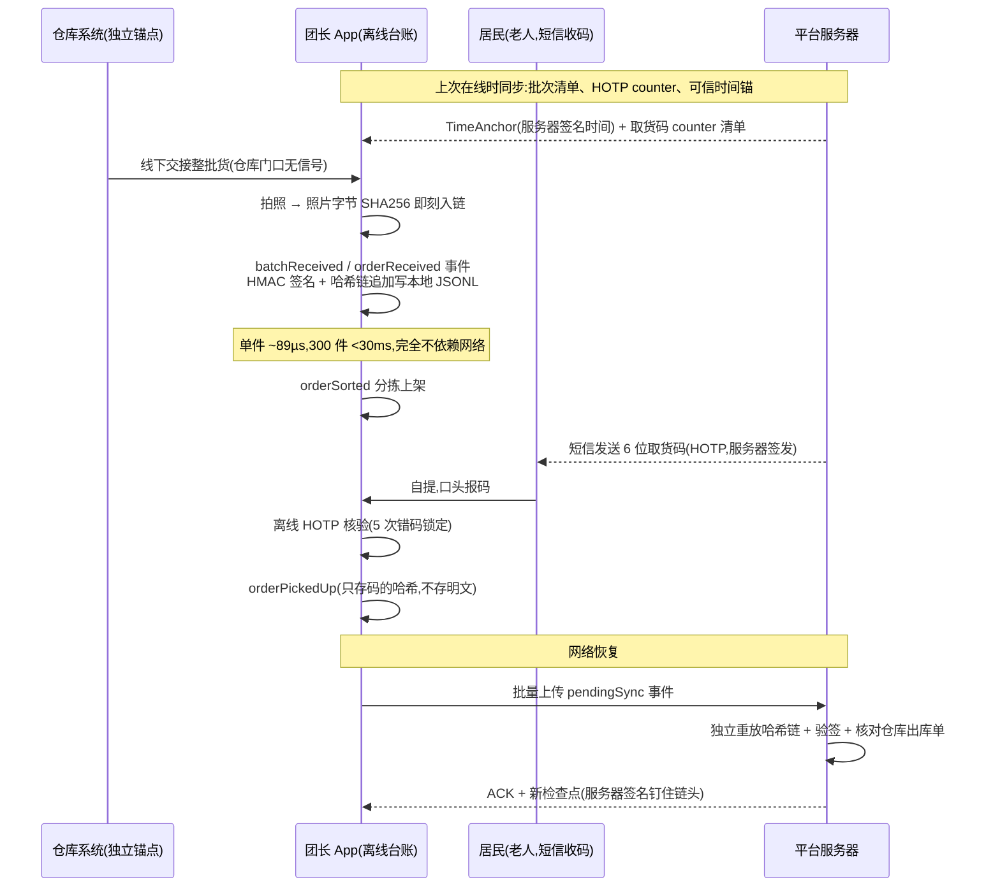
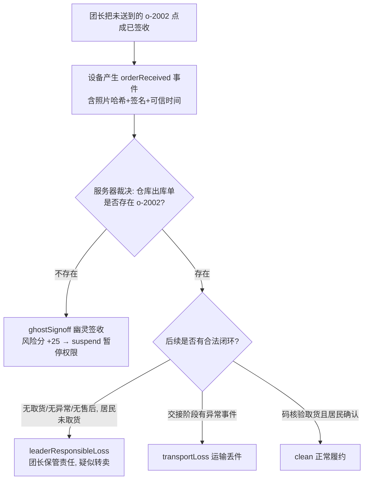
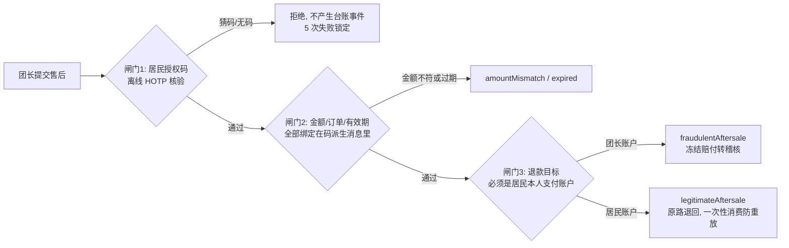

# 关键流程时序

## 1. 弱网接货 → 自提 → 联网补传(离线优先)

```mermaid
sequenceDiagram
    participant WH as 仓库系统(独立锚点)
    participant App as 团长 App(离线台账)
    participant R as 居民(老人,短信收码)
    participant Srv as 平台服务器

    Note over App,Srv: 上次在线时同步:批次清单、HOTP counter、可信时间锚
    Srv-->>App: TimeAnchor(服务器签名时间) + 取货码 counter 清单

    WH->>App: 线下交接整批货(仓库门口无信号)
    App->>App: 拍照 → 照片字节 SHA256 即刻入链
    App->>App: batchReceived / orderReceived 事件<br/>HMAC 签名 + 哈希链追加写本地 JSONL
    Note over App: 单件 ~89µs,300 件 <30ms,完全不依赖网络
    App->>App: orderSorted 分拣上架

    Srv-->>R: 短信发送 6 位取货码(HOTP,服务器签发)
    R->>App: 自提,口头报码
    App->>App: 离线 HOTP 核验(5 次错码锁定)
    App->>App: orderPickedUp(只存码的哈希,不存明文)

    Note over App,Srv: 网络恢复
    App->>Srv: 批量上传 pendingSync 事件
    Srv->>Srv: 独立重放哈希链 + 验签 + 核对仓库出库单
    Srv-->>App: ACK + 新检查点(服务器签名钉住链头)
```

## 2. 幽灵签收如何被还原

```mermaid
flowchart TD
    A[团长把未送到的 o-2002 点成已签收] --> B[设备产生 orderReceived 事件<br/>含照片哈希+签名+可信时间]
    B --> C{服务器裁决: 仓库出库单<br/>是否存在 o-2002?}
    C -->|不存在| D[ghostSignoff 幽灵签收<br/>风险分 +25 → suspend 暂停权限]
    C -->|存在| E{后续是否有合法闭环?}
    E -->|无取货/无异常/无售后, 居民未取货| F[leaderResponsibleLoss<br/>团长保管责任, 疑似转卖]
    E -->|交接阶段有异常事件| G[transportLoss 运输丢件]
    E -->|码核验取货且居民确认| H[clean 正常履约]
```

## 3. 售后防伪的三道闸门

```mermaid
flowchart LR
    A[团长提交售后] --> B{闸门1: 居民授权码<br/>离线 HOTP 核验}
    B -->|猜码/无码| X1[拒绝, 不产生台账事件<br/>5 次失败锁定]
    B -->|通过| C{闸门2: 金额/订单/有效期<br/>全部绑定在码派生消息里}
    C -->|金额不符或过期| X2[amountMismatch / expired]
    C -->|通过| D{闸门3: 退款目标<br/>必须是居民本人支付账户}
    D -->|团长账户| X3[fraudulentAftersale<br/>冻结赔付转稽核]
    D -->|居民账户| E[legitimateAftersale<br/>原路退回, 一次性消费防重放]
```
